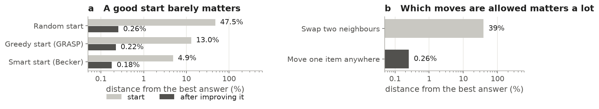
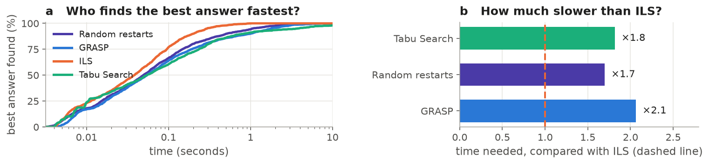
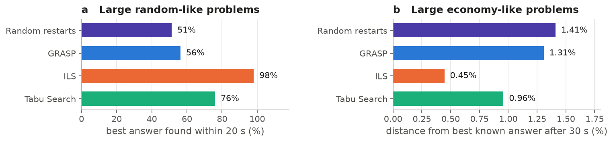
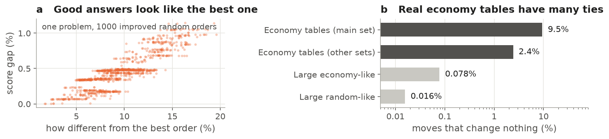
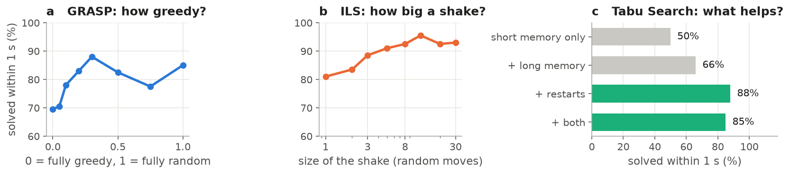

# Putting things in the best order: GRASP, ILS and Tabu Search

## The problem

You have a list of items and, for every pair, a score for putting one before the other. The goal is to find the
order with the highest total score: the **Linear Ordering Problem**. Checking every order is impossible
(50 items can be ordered in more ways than there are atoms on Earth), so we compare three well-known strategies that
find very good orders quickly:

- **GRASP**: build an order greedily with some randomness, improve it, and start again many times.
- **ILS** (Iterated Local Search): shake the best order found so far a little, improve it, and keep it if it is not worse.
- **Tabu Search**: keep changing the order while remembering recent changes, so they are not undone straight away.

The simplest baseline, **random restarts**, starts from random orders and improves them.

## Where it is useful

Ordering the sectors of an economy (the classic use, and most of our test problems), ranking teams or players from
head-to-head results, combining voters' rankings into one consensus, and scheduling tasks when some orders are preferred.

## What we learned

We tested the methods on 157 problems: 49 real economy tables whose best order is known, and 108 larger problems of
up to 250 items. Every method got the same time, and every test was repeated many times.

| Method | Economy tables: best order found | Economy tables: time needed | Large random-like: best order found | Large economy-like: distance from best known |
| :--- | :-: | :-: | :-: | :-: |
| **ILS** | **100 %** | **1×** | **98 %** | **0.45 %** |
| Tabu Search | 98 % | 1.8× | 76 % | 0.96 % |
| Random restarts | 99.9 % | 1.7× | 51 % | 1.41 % |
| GRASP | 99.9 % | 2.1× | 56 % | 1.31 % |

**1. How you improve an order matters much more than where you start.** Clever and random starts end within 0.3 % of
the best once improved. The kind of change matters: moving one item anywhere gets to 0.26 %, swapping neighbours gets stuck at 39 %.

**2. ILS is the best method.** It found the best order of every economy table in every run, about twice as fast as the
others, and the lead grows on larger problems. It does not win everywhere: on one table it succeeded in only 63 % of
runs while the other methods always did.

**3. Why ILS works: good orders look like the best order.** So shaking a good order a little and improving it again
searches right next to the best answer (left). Real economy tables also have many "ties", changes that do not affect the
score (right).

**4. Tabu Search needs restarts, and GRASP's greediness helps little.** On its own, Tabu Search goes round in circles;
restarting it from its best order raises its success from 50 % to 88 % (right). A medium level of greediness is best for GRASP, but it is
barely better than random starts (left). For ILS, very small shakes (1–3 moves) are often undone; about 8 moves or more works best (middle).

*Detailed numbers for every test: [`results/tables/`](results/tables).*
